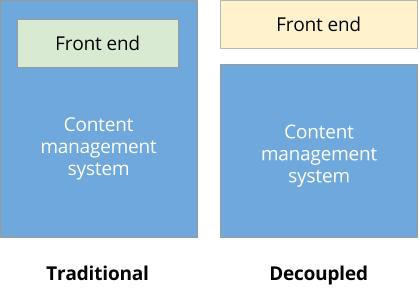
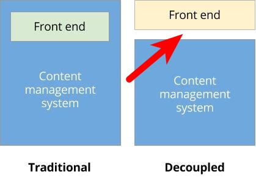
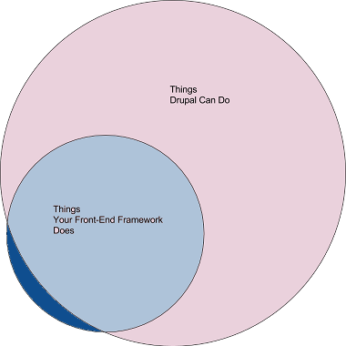

# The Risks of Going Headless

# About Me

* 
* **Mark Ferree**
* **Director of Engineering** @ Chapter Three
* **mrf** on Drupal.org, Twitter & Github

# Background
* 

# Distributed Teams
* 

# Duplicate Functionality

* 

# Abstraction

* 

# Single Points of Failure

* 

# More Info

* chapterthree.com/blog/decapitated-drupal-downsides-of-decoupling

* buytaert.net/the-future-of-decoupled-drupal

#EOF

**Mark Ferree** 

mark@chapterthree.com
